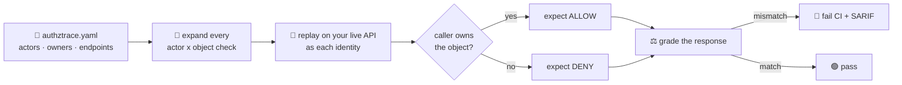

<p align="center">
  
</p>

<h1 align="center">🛡️ AuthzTrace</h1>

<p align="center">
  <strong>Unit tests for <em>who is allowed to touch what.</em></strong><br>
  Catch IDOR/BOLA — the #1 OWASP API risk — on every pull request, before it ships.
</p>

<p align="center">
  <a href="https://pypi.org/project/authztrace/"></a>
  <a href="https://pypi.org/project/authztrace/"></a>
  <a href="https://github.com/Asttr0/AuthzTrace/actions/workflows/ci.yml"></a>
  
  <a href="https://github.com/marketplace/actions/authztrace"></a>
  <a href="https://github.com/Asttr0/AuthzTrace/blob/main/LICENSE"></a>
  <a href="https://github.com/Asttr0/AuthzTrace/stargazers"></a>
</p>

<p align="center">
  <a href="#-quickstart">Quickstart</a> ·
  <a href="#-how-it-works">How it works</a> ·
  <a href="#-safe-by-default">Safe by default</a> ·
  <a href="#-why-not-a-normal-scanner">Why not a scanner</a> ·
  <a href="docs/CORPUS.md">Roadmap</a>
</p>

---

Every API scanner can crawl `GET /api/invoices/inv_123`. **None of them know that `inv_123` belongs to Alice** — and must never be readable by Bob. Ownership isn't in the traffic; it's in your business logic. That's why BOLA has stayed #1 on the OWASP API Top 10: it's invisible to tools that don't know who owns what.

**AuthzTrace makes you declare it.** You write a short contract — actors, who owns which objects, which endpoints — and AuthzTrace generates the entire cross-user attack matrix, replays it against your live API as each identity, and **fails the build the moment authorization breaks.**

## 🎬 Watch it catch a real bug

Point it at an API where anyone can read anyone's invoice, and the matrix lights up red:

```diff
  RESULT  ACTOR  TARGET  EXPECT  STATUS  METHOD  PATH
+ PASS    alice  alice   allow   200     GET     /api/invoices/inv_alice_001
- FAIL    bob    alice   deny    200     GET     /api/invoices/inv_alice_001
-         └─ BOLA: 'bob' read alice's invoice — HTTP 200, leaked "Alice private invoice"
+ PASS    anon   alice   deny    401     GET     /api/invoices/inv_alice_001
- FAIL    alice  bob     deny    200     POST    /api/invoices/lookup
-         └─ BOLA: 'alice' read bob's invoice — HTTP 200, leaked "Bob private invoice"
+ PASS    bob    bob     allow   200     GET     /api/invoices/inv_bob_002
```

```text
12 passed, 6 failed, 0 warnings, 0 errors, 6 skipped, 24 checks
categories: bola=6, unsafe_skipped=6      →  exit 1  ❌  pull request blocked
```

Add the one-line ownership check to your API and run again — **green, exit 0.** That red→green flip *is* the product: a regression test that fails the PR the instant someone reintroduces an IDOR.

```text
18 passed, 0 failed, 0 warnings, 0 errors, 6 skipped, 24 checks      →  exit 0  ✅
```

## ⚡ Quickstart

```bash
pip install authztrace
```

**Scaffold** a starter contract straight from your OpenAPI spec:

```bash
authztrace init --from openapi.yaml --output authztrace.yaml
```

**Run** it against your API — emit SARIF for the GitHub Security tab:

```bash
authztrace run -c authztrace.yaml --sarif authztrace.sarif
```

**Ship it in CI** with the Marketplace Action:

```yaml
- uses: Asttr0/AuthzTrace@v0.3.1
  with:
    config: authztrace.yaml
    sarif: authztrace.sarif
    strict: "true"
```

Exit codes are designed for pipelines — clean, finding, and *broken setup* are three different things:

| Code | Meaning |
|:---:|---|
| `0` | ✅ clean — every actor lands exactly where the contract says |
| `1` | ❌ a BOLA/leak finding (or a warning under `--strict`) |
| `2` | ⚠️ setup failure — bad token, unreachable API, unreadable fixture |

> **Why `2` matters:** if a token is expired, a naive tester would see "access denied" everywhere and report a false all-clear. AuthzTrace runs a **preflight** first — if an owner can't even reach their *own* object, it aborts with `2` instead of pretending the API is safe.

## 🔬 How it works



You declare intent once; AuthzTrace generates the permutations you'd otherwise write by hand — every identity against every object, on every endpoint shape.

## 📝 The contract

```yaml
base_url: http://localhost:3000

actors:
  alice: { auth: { type: bearer, token: "${ALICE_TOKEN}" } }
  bob:   { auth: { type: bearer, token: "${BOB_TOKEN}" } }
  anon:  { auth: { type: none } }

resources:
  invoice:
    ids:
      alice: inv_alice_001      # alice owns this
      bob:   inv_bob_002        # bob owns this
    markers:
      alice: "Alice private invoice"
      bob:   "Bob private invoice"
    endpoints:
      - name: read invoice
        request: GET /api/invoices/{id}
        assertions:
          allow_contains:    ["{marker}"]   # owner must SEE their data
          deny_not_contains: ["{marker}"]   # everyone else must NOT

policy:
  default: owner-only
  deny_status: [401, 403, 404]
```

That handful of lines expands into every `actor × object` check: **owners must pass, everyone else must be denied, and a denied response must never leak the owner's marker** — so you also catch the "returns 403 but ships the data anyway" bugs.

## 🔒 Safe by default

AuthzTrace runs in CI against real APIs, so it **never fires mutating requests unless you ask it to.**

| Method | Default | |
|---|:---:|---|
| `GET` · `HEAD` · `OPTIONS` | ▶️ executed | the RFC-safe methods |
| `POST` · `PUT` · `PATCH` · `DELETE` | ⏭️ skipped | won't touch your data |

Opt a read-like `POST` back in per-endpoint, or run the full set against disposable data:

```yaml
- method: POST
  path: /api/search
  safe: true          # this POST only reads — run it
```

```bash
authztrace run -c authztrace.yaml --include-unsafe   # run POST/PUT/PATCH/DELETE too
```

Skipped rows show as `SKIP` and are **never counted as passes** — no silent false confidence.

## 🧪 What it catches

| Pattern | |
|---|:---:|
| Horizontal IDOR / BOLA (user A reads user B's object) | ✅ |
| Anonymous access to owned objects | ✅ |
| IDs hidden in path, query, header, JSON body, or form body | ✅ |
| Denied responses that still leak the object | ✅ |
| Allowed responses missing the owner's own data | ✅ |
| Admin / shared authorization rules (`allow: [admin]`, `[authenticated]`) | ✅ |
| Broken-credential false-green prevention (preflight) | ✅ |
| Nested parent-child ownership · login-flow auth · GraphQL BOLA | 🗺️ planned |

Full attack corpus & roadmap → **[docs/CORPUS.md](docs/CORPUS.md)**

## 🆚 Why not a normal scanner?

| | Generic scanner (ZAP, Nuclei…) | **AuthzTrace** |
|---|:---:|:---:|
| Knows object ownership | ❌ can't infer it | ✅ you declare it |
| Tests cross-user access | 🟡 weak | ✅ full matrix |
| Fails CI on a proven BOLA | 🟡 sometimes | ✅ always |
| Contract lives next to your code | ❌ | ✅ |
| Won't mutate your API by accident | 🟡 varies | ✅ safe by default |

Authorization is business logic — the fix isn't a smarter crawler, it's letting *you* declare intent and proving it on every commit. **That declaration is the moat.**

<details>
<summary><h3>🧩 Endpoint shapes — IDs live in more than paths</h3></summary>

<br>

Object IDs can be probed in the path, query string, headers, JSON body, or form body:

```yaml
endpoints:
  - request: GET /api/invoices/{id}           # path

  - method: GET
    path: /api/invoices
    query: { id: "{id}" }                      # query string

  - method: POST
    path: /api/invoices/lookup
    safe: true
    json: { invoice_id: "{id}" }               # JSON body
```

**Exact placeholders keep their type.** If an ID is numeric, `invoice_id: "{id}"` sends a number, not `"123"`.

Override owner-only rules for shared or privileged endpoints:

```yaml
- request: GET /api/admin/invoices/{id}
  allow: [owner, admin]        # admins may reach any object

- request: GET /api/team/invoices/{id}
  allow: [authenticated]       # any signed-in user may read
```

</details>

<details>
<summary><h3>📤 Output formats — SARIF, JSON, JUnit</h3></summary>

<br>

```bash
authztrace run -c authztrace.yaml \
  --sarif authztrace.sarif \      # GitHub Security tab / code scanning
  --json  authztrace.json  \      # machine-readable for any pipeline
  --junit authztrace.xml          # test reporters & dashboards
```

SARIF findings carry **stable partial fingerprints** keyed on endpoint identity (not the fixture ID), so GitHub Code Scanning tracks the same alert across runs instead of spawning a new one every time you rotate test data. BOLA and data-leak findings are split into distinct rules.

</details>

<details>
<summary><h3>🏁 Run the demo locally (60 seconds)</h3></summary>

<br>

```bash
git clone https://github.com/Asttr0/AuthzTrace.git && cd AuthzTrace
pip install -e .
pip install -r examples/vulnerable-api/requirements.txt

python examples/vulnerable-api/app.py          # deliberately vulnerable
```

In another terminal:

```bash
export ALICE_TOKEN=alice-token BOB_TOKEN=bob-token
authztrace run -c examples/authztrace.yaml     # → red, exit 1

# now flip the ownership fix on and watch it go green:
SECURE=1 python examples/vulnerable-api/app.py
authztrace run -c examples/authztrace.yaml     # → green, exit 0
```

</details>

## 📌 Status

**Alpha, but usable end to end** — on PyPI, live as a Marketplace Action, with SARIF/JSON/JUnit output, OpenAPI scaffolding, read-only safety, the setup preflight, and the vulnerable demo all working today.

**Next up:** login-flow auth · nested parent-child ownership · GraphQL BOLA · baselines for accepted deviations.

Found an IDOR pattern in the wild that AuthzTrace should catch? [Open an issue](https://github.com/Asttr0/AuthzTrace/issues) — real-world contracts are the most valuable contribution.

---

<p align="center">
  <strong>If AuthzTrace could catch a bug in your API, ⭐ the repo — it helps other teams find it.</strong><br>
  <sub>MIT © 2026 Mohamed Taha Slimani · <a href="https://github.com/Asttr0">@Asttr0</a></sub>
</p>
