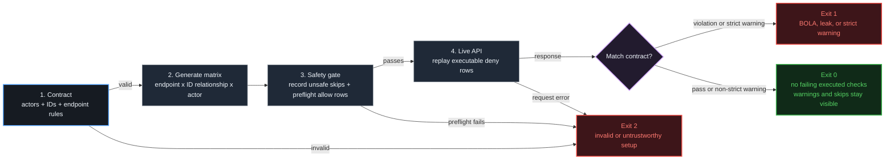

<p align="center">
  
</p>

<p align="center">
  <a href="https://pypi.org/project/authztrace/"></a>
  <a href="https://pypi.org/project/authztrace/"></a>
  <a href="https://github.com/Asttr0/AuthzTrace/actions/workflows/ci.yml"></a>
  
  <a href="https://github.com/marketplace/actions/authztrace"></a>
  <a href="LICENSE"></a>
  <a href="https://github.com/Asttr0/AuthzTrace/stargazers"></a>
</p>

<p align="center">
  <a href="#how-it-works">How it works</a> &middot;
  <a href="#quickstart">Quickstart</a> &middot;
  <a href="#the-contract">Contract</a> &middot;
  <a href="#built-for-trustworthy-ci">CI guarantees</a> &middot;
  <a href="docs/CORPUS.md">Roadmap</a>
</p>

## How it works



## What AuthzTrace does

**AuthzTrace is an authorization contract test runner for REST APIs.** You describe test identities, object ownership, and expected access once. AuthzTrace expands every endpoint across each owned object and declared actor, including anonymous actors you explicitly define.

> `GET /invoices/inv_A -> 200` means nothing by itself. When the contract says `inv_A` belongs to Alice, the same `200` for Bob is a proven BOLA.

| You declare | AuthzTrace generates | CI receives |
| --- | --- | --- |
| Actors and credentials | Every endpoint x object x declared actor request | A reproducible authorization verdict |
| Owners and scalar or named fixture IDs | Owner, cross-user, nested-relationship, and anonymous checks | SARIF findings with stable fingerprints |
| Endpoints and access rules | Status and response-leak assertions | Exit codes that separate findings from broken setup |

## Quickstart

Install the CLI:

```bash
pip install authztrace
```

For a FastAPI project, discover routes and authorization evidence directly from source. An OpenAPI document is optional, but gives AuthzTrace the authoritative public route paths and server URL:

```bash
authztrace init --from-source . --openapi openapi.yaml
```

AuthzTrace statically reads the code without importing the application. It confirms route and identifier facts, suggests `owner` only when it finds a supported ownership comparison, and asks you to review every remaining policy. It writes the executable contract to `authztrace.yaml` and provenance to `authztrace.evidence.json`.

For automation, probable owner policies can be accepted explicitly. If any endpoint is still unresolved, this exits `2` and does not write a contract:

```bash
authztrace init --from-source . --accept-probable --non-interactive
```

On later runs, preserve reviewed decisions by endpoint identity. New or renamed endpoints still require review:

```bash
authztrace init --from-source . \
  --decisions authztrace.evidence.json \
  --non-interactive --force
```

For other frameworks, scaffold from OpenAPI and review the generated ownership rules:

```bash
authztrace init --from openapi.yaml
```

See [source inference](docs/SOURCE_INFERENCE.md) for the supported FastAPI patterns and trust model.

Point `base_url` at a running **non-production** API, then add stable test-object IDs and actor credentials. Secrets can stay in environment variables:

```bash
export ALICE_TOKEN="..."
export BOB_TOKEN="..."

authztrace run -c authztrace.yaml --sarif authztrace.sarif
```

No OpenAPI document? Start from the [working example](examples/authztrace.yaml).

<details>
<summary><b>Run it in GitHub Actions</b></summary>

```yaml
permissions:
  contents: read
  actions: read
  security-events: write

steps:
  - uses: actions/checkout@v4

  # Start your API here, or point base_url at a reachable test environment.
  - uses: Asttr0/AuthzTrace@v0.6.0
    env:
      ALICE_TOKEN: ${{ secrets.ALICE_TOKEN }}
      BOB_TOKEN: ${{ secrets.BOB_TOKEN }}
    with:
      config: authztrace.yaml
      sarif: authztrace.sarif

  - uses: github/codeql-action/upload-sarif@v4
    if: ${{ always() && (github.event_name != 'pull_request' || github.event.pull_request.head.repo.full_name == github.repository) }}
    with:
      sarif_file: authztrace.sarif
```

</details>

## The contract

This contract says Alice and Bob each own one invoice. Owners may read their own invoice; every other identity must be denied without receiving the owner's marker.

```yaml
base_url: https://api.test.example.com

actors:
  alice: { auth: { type: bearer, token: "${ALICE_TOKEN}" } }
  bob:   { auth: { type: bearer, token: "${BOB_TOKEN}" } }
  anon:  { auth: { type: none } }

resources:
  invoice:
    ids:     { alice: inv_A, bob: inv_B }
    markers: { alice: "Alice private", bob: "Bob private" }
    endpoints:
      - request: GET /api/invoices/{id}
        allow: [owner]
        assertions:
          allow_contains: ["{marker}"]
          deny_not_contains: ["{marker}"]

policy:
  deny_status: [401, 403, 404]
```

That single endpoint becomes six checks: one endpoint x two owned objects x three declared actors. Alice and Bob must retrieve their own marker; the other user and `anon` must receive a deny status and never see it.

Object IDs can also live in query parameters, headers, JSON, or form bodies. Endpoint `allow` rules accept `owner`, named actors, `authenticated`, `anonymous`, `all`, or `*`.

<details>
<summary><b>Test nested parent/child ownership</b></summary>

Name each ID and set `target_id` to the protected child:

```yaml
resources:
  org_user:
    target_id: user_id
    ids:
      alice: { org_id: org_A, user_id: user_A }
      bob:   { org_id: org_B, user_id: user_B }
    endpoints:
      - request: GET /api/orgs/{org_id}/users/{user_id}
        allow: [owner]
```

For Alice, AuthzTrace checks `(org_A, user_A)` as allowed and requires denial for `(org_A, user_B)`, `(org_B, user_A)`, and `(org_B, user_B)`. Named IDs work in paths, queries, headers, JSON, and form bodies. See the [complete nested example](examples/authztrace-nested.yaml).

</details>

### Runtime login flows

Actors can acquire credentials from the API before preflight instead of receiving a static token. Each actor gets an isolated HTTP session, and a failed login or missing credential aborts the run as untrustworthy setup with exit code `2`.

```yaml
actors:
  alice:
    auth:
      type: login
      request: POST /api/login
      json:
        username: alice
        password: "${ALICE_PASSWORD}"
      extract: { from: json, path: session.access_token }
      credential: { type: bearer }
```

`extract.from` accepts `json`, `header`, or `cookie`. JSON extraction uses a dotted `path`; header and cookie extraction use `name`. The resulting credential can be applied as `bearer`, `header`, or `cookie`, and `expect_status` can override the default 2xx login expectation. OAuth-style form payloads, separate HTTP(S) identity-provider URLs, redirect control, and custom token schemes are supported.

Login requests are explicit setup operations and therefore run before the read-only endpoint safety gate, including `POST` logins. Keep targets pointed at controlled non-production environments. See the [authentication guide](docs/AUTHENTICATION.md) and [complete login-flow demo contract](examples/authztrace-login.yaml).

## Built for trustworthy CI

| Behavior | Guarantee |
| --- | --- |
| Credential preflight | Every executable `allow` row must pass before deny rows run. Broken credentials or fixtures cannot produce a false green. |
| Read-only default | Only `GET`, `HEAD`, and `OPTIONS` execute automatically. Other methods are visibly skipped unless marked `safe: true` or enabled with `--include-unsafe`. |
| Leak detection | A denied response still fails if it contains a forbidden marker or JSON field. |
| CI-native reports | Terminal, SARIF, JSON, and JUnit output; SARIF includes stable fingerprints for GitHub code scanning. |
| Flexible authentication | Static Bearer, custom-header, cookie, and Basic credentials; anonymous actors; and isolated request-and-extract login flows. Actor credentials are excluded from reports. |

| Exit | Meaning |
| ---: | --- |
| `0` | No failing findings among executed checks; warnings and skipped unsafe rows remain visible |
| `1` | BOLA, response leak, or strict warning |
| `2` | Untrustworthy setup: bad credentials, unreadable owner fixture, invalid contract, or unreachable API |

## Current scope

AuthzTrace is alpha software focused on REST authorization regression testing with stable fixtures and static or runtime login credentials. It supports scalar objects, nested parent/child ownership, OpenAPI scaffolding, and reviewed FastAPI source inference. Source inference currently recognizes static router declarations, path/query IDs, common SQLAlchemy lookups, and direct ownership comparisons; dynamic route registration, arbitrary service-layer policy, request-body inference, and other frameworks remain unsupported. Method-override, predictable-ID, mass-assignment, and GraphQL coverage remain planned. See the [authorization test corpus](docs/CORPUS.md) for the full status.

---

<p align="center">
  <sub>Found AuthzTrace useful? Star the repository so more API teams can find it.<br>
  MIT &copy; 2026 Mohamed Taha Slimani &middot; <a href="https://github.com/Asttr0">@Asttr0</a> &middot; <a href="https://github.com/Asttr0/AuthzTrace/issues">Issues</a></sub>
</p>
