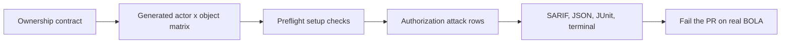

# AuthzTrace

**Authorization tests for IDOR/BOLA bugs.**

AuthzTrace proves that one user cannot access another user's objects by replaying an authorization contract against your real API.


Most scanners cannot reliably find IDOR/BOLA because they do not know ownership. They can see `/api/invoices/inv_123`, but they do not know that `inv_123` belongs to Alice and must not be readable by Bob.

AuthzTrace makes that missing context explicit:

```text
Alice owns inv_alice_001
Bob owns inv_bob_002

AuthzTrace checks:
- Alice can read Alice's invoice
- Bob cannot read Alice's invoice
- Anonymous users cannot read either invoice
- The same policy holds for path IDs, query IDs, JSON body IDs, and more
```



## Why It Exists

Broken Object Level Authorization is the classic IDOR problem: changing an object ID lets one user reach another user's data. It is still hard to catch automatically because authorization is business logic.

AuthzTrace is not a crawler. It is closer to a contract test:

| You declare | AuthzTrace proves |
|---|---|
| Actors and auth tokens | Each identity can authenticate |
| Object IDs and owners | Owners can access their own objects |
| API endpoints | Other users are denied |
| Response markers | Denied responses do not leak protected data |

If credentials or test fixtures are broken, AuthzTrace exits with a setup error instead of giving a false green result.

## Quick Demo

Install AuthzTrace:

```bash
pip install authztrace
```

For local development from this repo:

```bash
git clone https://github.com/Asttr0/AuthzTrace.git
cd AuthzTrace
pip install -e .
pip install -r examples/vulnerable-api/requirements.txt
```

Start the deliberately vulnerable demo API:

```bash
python examples/vulnerable-api/app.py
```

In another terminal, run AuthzTrace:

```bash
export ALICE_TOKEN=alice-token
export BOB_TOKEN=bob-token
authztrace run -c examples/authztrace.yaml
```

You get a real authorization finding:

```text
RESULT ACTOR      TARGET     EXPECT  STATUS  METHOD  PATH
------------------------------------------------------------------------------------------------
PASS   alice      alice      allow   200     GET     /api/invoices/inv_alice_001
FAIL   bob        alice      deny    200     GET     /api/invoices/inv_alice_001
         -> BOLA: 'bob' accessed alice's invoice (inv_alice_001) - HTTP 200
PASS   anon       alice      deny    401     GET     /api/invoices/inv_alice_001
...
SKIP   alice      alice      allow   -       DELETE  /api/invoices/inv_alice_001
         -> unsafe DELETE skipped in read-only mode
...
12 passed, 6 failed, 0 warnings, 0 errors, 6 skipped, 24 checks
categories: bola=6, unsafe_skipped=6
```

Stop the first server with `Ctrl+C`, then run the fixed API:

```bash
SECURE=1 python examples/vulnerable-api/app.py
authztrace run -c examples/authztrace.yaml
```

The same contract becomes green:

```text
18 passed, 0 failed, 0 warnings, 0 errors, 6 skipped, 24 checks
categories: unsafe_skipped=6
```

## Minimal Contract

```yaml
base_url: http://localhost:3000

actors:
  alice: { auth: { type: bearer, token: "${ALICE_TOKEN}" } }
  bob:   { auth: { type: bearer, token: "${BOB_TOKEN}" } }
  anon:  { auth: { type: none } }

resources:
  invoice:
    ids:
      alice: inv_alice_001
      bob: inv_bob_002
    markers:
      alice: "Alice private invoice"
      bob: "Bob private invoice"
    endpoints:
      - name: read invoice
        request: GET /api/invoices/{id}
        assertions:
          allow_contains: ["{marker}"]
          deny_not_contains: ["{marker}"]

policy:
  default: owner-only
  deny_status: [401, 403, 404]
```

From this, AuthzTrace generates the full matrix:

```text
alice -> alice invoice  should allow
bob   -> alice invoice  should deny
anon  -> alice invoice  should deny
alice -> bob invoice    should deny
bob   -> bob invoice    should allow
anon  -> bob invoice    should deny
```

## Endpoint Shapes

Object IDs can live almost anywhere:

```yaml
endpoints:
  - request: GET /api/invoices/{id}

  - method: GET
    path: /api/invoices
    query:
      id: "{id}"

  - method: POST
    path: /api/invoices/lookup
    safe: true
    json:
      invoice_id: "{id}"
```

Exact placeholders preserve their type. If an ID is numeric, `invoice_id: "{id}"` sends a number, not a string.

For endpoints that are intentionally shared, override the default owner-only rule:

```yaml
- request: GET /api/admin/invoices/{id}
  allow: [owner, admin]

- request: GET /api/team/invoices/{id}
  allow: [authenticated]
```

## Safe By Default

AuthzTrace is designed for CI, so it does not execute mutating endpoints by default.

| Method | Default |
|---|---|
| `GET`, `HEAD`, `OPTIONS` | executed |
| `POST`, `PUT`, `PATCH`, `DELETE` | skipped |

Mark read-like POST endpoints as safe:

```yaml
- method: POST
  path: /api/search
  safe: true
```

Run unsafe endpoints only when you have disposable test data:

```bash
authztrace run -c authztrace.yaml --include-unsafe
```

Skipped endpoints are reported as `SKIP`, not counted as passes.

## CI Usage

AuthzTrace returns clear exit codes:

| Code | Meaning |
|---:|---|
| `0` | clean |
| `1` | real finding, or warning in `--strict` mode |
| `2` | setup or operational failure |

Generate SARIF for GitHub code scanning:

```bash
authztrace run -c authztrace.yaml --sarif authztrace.sarif
```

Or use the composite GitHub Action:

```yaml
- uses: Asttr0/AuthzTrace@v0.3.0
  with:
    config: authztrace.yaml
    sarif: authztrace.sarif
    strict: "true"
    include-unsafe: "false"
```

JSON and JUnit are also available:

```bash
authztrace run -c authztrace.yaml \
  --json authztrace.json \
  --junit authztrace.xml
```

## Generate A Starter Contract

You can scaffold a contract from OpenAPI:

```bash
authztrace init --from openapi.yaml --output authztrace.yaml
```

The generator is conservative. It detects simple single-object endpoints such as:

```text
GET /api/invoices/{invoice_id}
GET /api/invoices?id=...
```

You still review the generated IDs, actors, and ownership before using it in CI.

## What It Catches

AuthzTrace currently covers:

- horizontal IDOR/BOLA
- anonymous object access
- object IDs in path, query, headers, JSON body, and form body
- denied responses that leak protected markers
- allowed responses that return the wrong body
- privileged actors through endpoint `allow` rules
- unsafe endpoint skipping for CI safety
- setup failures from broken credentials or invalid fixtures

The full pattern roadmap lives in [docs/CORPUS.md](docs/CORPUS.md).

## Why Not A Normal Scanner?

| Capability | Generic scanner | AuthzTrace |
|---|:---:|:---:|
| Knows object ownership | no | yes |
| Tests cross-user access | weak | yes |
| Runs in CI | sometimes | yes |
| Produces SARIF | sometimes | yes |
| Keeps the security rule next to code | no | yes |

The point is simple: if your API says Bob can read Alice's invoice, AuthzTrace should make the pull request fail.

## Status

Alpha. The core engine, contract format, OpenAPI starter generator, terminal/SARIF/JSON/JUnit output, GitHub Action, read-only safety model, and demo API are working end to end.

Next priorities:

- login-flow auth
- nested parent-child ownership
- GraphQL BOLA checks
- baselines for accepted deviations

## License

MIT (c) 2026 Mohamed Taha Slimani ([@Asttr0](https://github.com/Asttr0))
